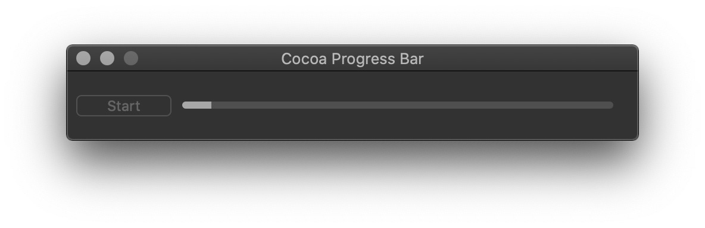

# Cocoa Determinate Progress Bar

This repository contains implementation of NSProgressIndicator which value is updated using NSTimer.

[Cocoa macOS Examples](https://github.com/NikolaGrujic91/Cocoa-macOS-Examples)

